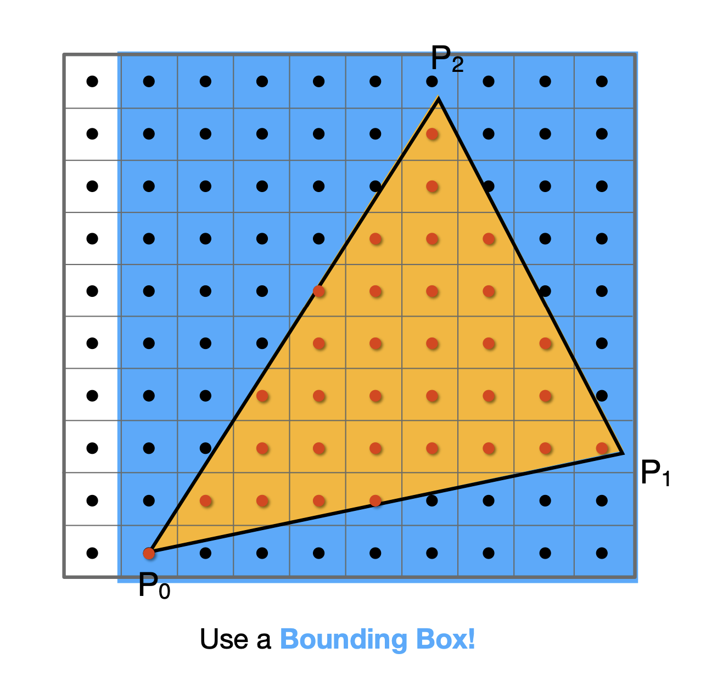
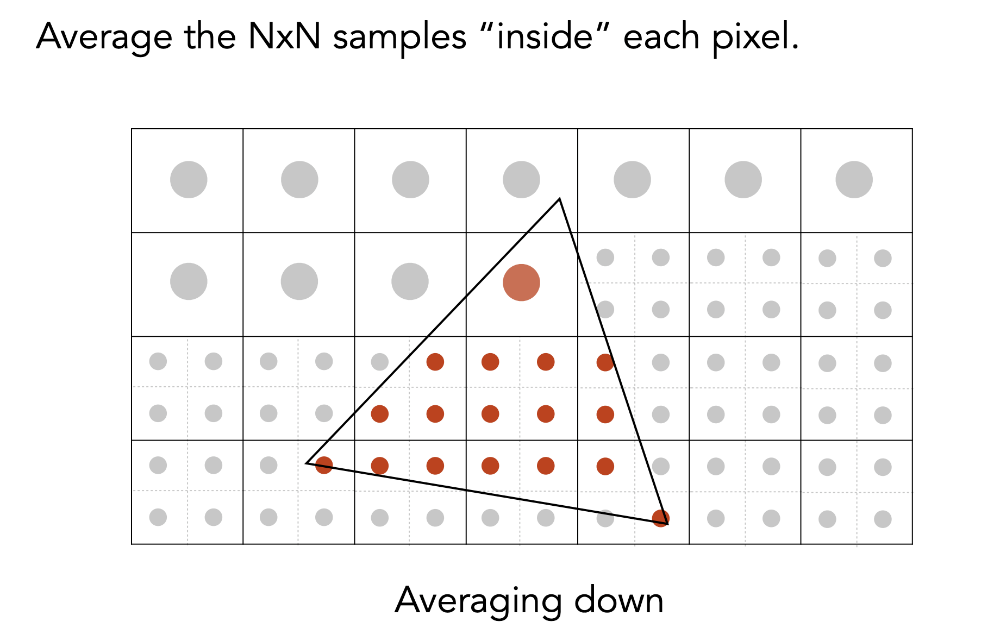

### Shear Matrix

### Rotation Matrix

### Panning Matrix(vector)

Remembre there is a `T`, so it is a vertical vector.

Notice, 2d vector has `translation invariance`, so the last number is `0`

point + point = the mid point of these two point

### Viewing transformation

#### 3D rotation

rotation formula

camera

正交投影：符合事实但是不符合现实

透视投影：符合人眼

正交投影

$$
M_{ortho}
=
\begin{bmatrix}
    \frac{2}{r-l} & 0 & 0 & -\frac{r+l}{r-l} \\
    0 & \frac{2}{t-b}& 0 & -\frac{t+b}{t-b} \\
    0 & 0 & \frac{2}{n-f} & -\frac{n+f}{n-f} \\
    0 & 0 & 0 & 1 \\
\end{bmatrix}
$$
透视投影

$$
M_{persp\to ortho}
=
\begin{bmatrix}
    n & 0 & 0 & 0 \\
    0 & n & 0 & 0 \\
    0 & 0 & n+f & -nf \\
    0 & 0 & 1 & 0 \\
\end{bmatrix}
$$

标准化

视距推导边界

### 离散化和采样

首先判断是否在三角形内部
$$
P0P1 \cross P0Q\\
P1P2 \cross P1Q\\
P2P0 \cross P2Q
$$
三者同号说明在内部

寻找上下界划分`Bounding Box`

### 抗锯齿

傅立叶变换

滤波后采样 不能采样后滤波

注意前面是**WRONG！**

### MSAA

时域上进行卷积

现代抗锯齿

### Z-buffer

用于判断前后着色器的

### 着色(Shading)

入射光 法线 反射光 -> viewpoint

着色有局部性，only focus on shading instead of shadowing

### 漫反射(Diffuse Reflection)

会反射到各个地方去

#### 能量衰减

漫反射系数决定了颜色/亮度

### 高光

判断半程向量是否接近，就是$n$和$h$是否接近，经验模型，判断是否能看到高光，主要是半程向量好算。指数$p$代表reflection lobe，用于快速下降高光值。

#### 环境光照

环境光其实是一个常数，是一个大概，为了保证没有一个地方是完全黑的，真正计算需要全局光照的知识。

合并光简化模型。

求每个三角形法线的情况

定点+插值判断每个三角形

Phong是着色频率

法线平均->点的法线

定义UV坐标系

### 图形渲染管线(pipeline)

个人认为这是一个很重要的概念，便于理解渲染的整个流程

#### 双线性插值

#### Mipmap

没懂 需要过后面再看

