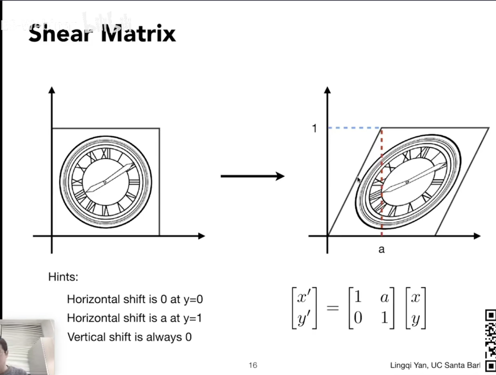
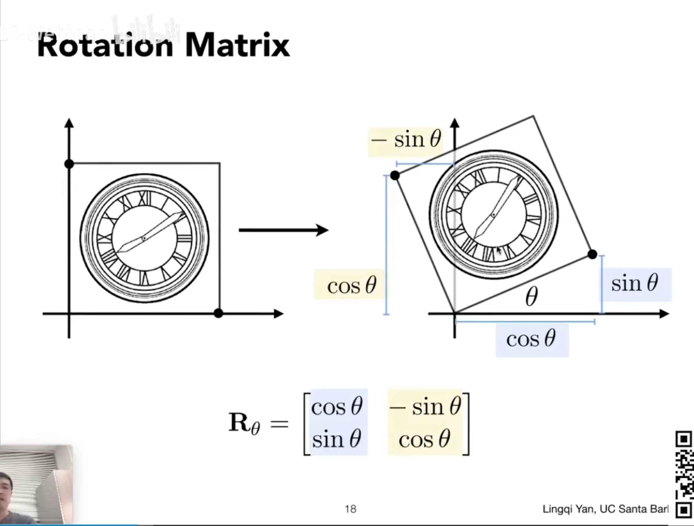
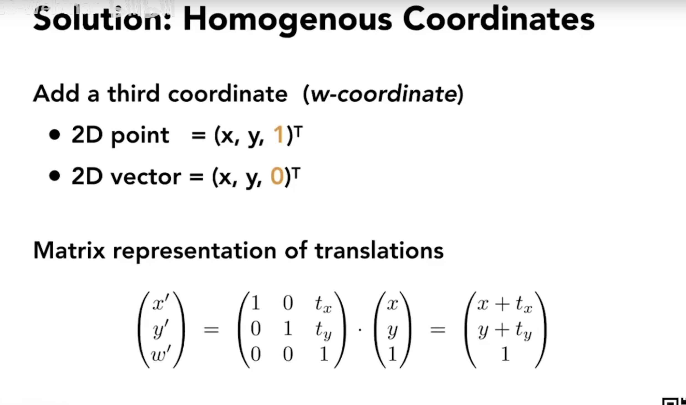
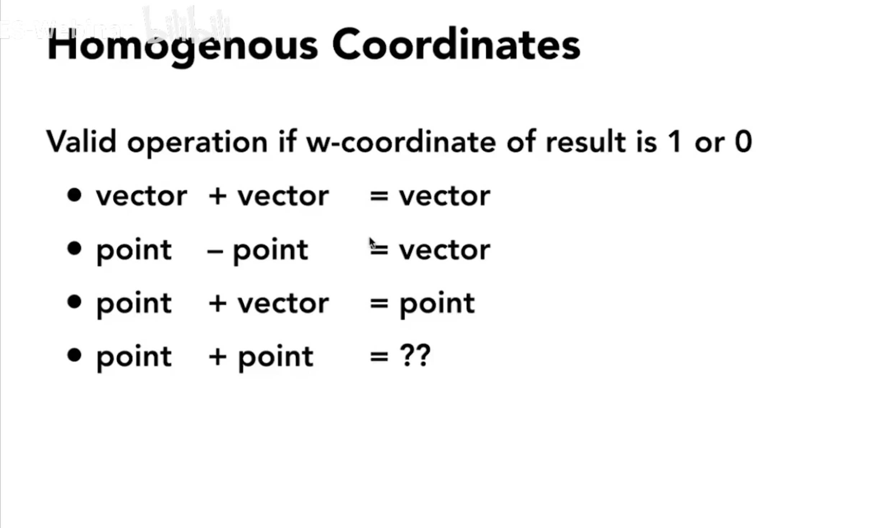
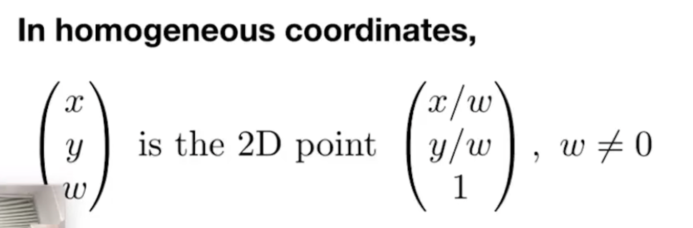
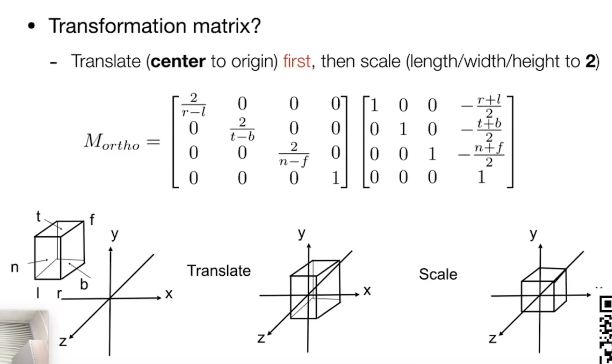
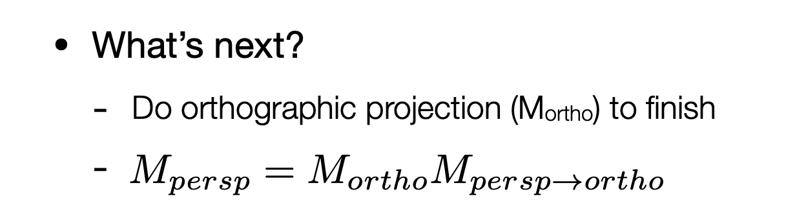
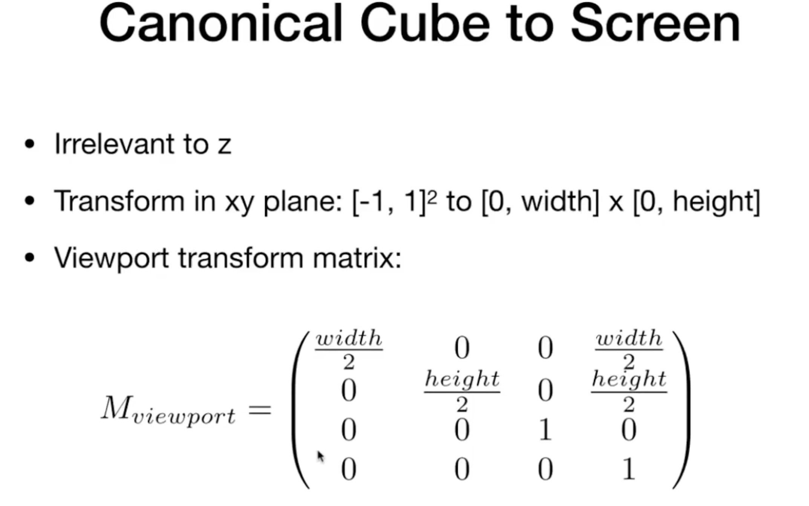

### Shear Matrix

### Rotation Matrix

### Panning Matrix(vector)

Remembre there is a `T`, so it is a vertical vector.

Notice, 2d vector has `translation invariance`, so the last number is `0`

point + point = the mid point of these two point

### Viewing transformation

#### 3D rotation

rotation formula

camera

正交投影：符合事实但是不符合现实

透视投影：符合人眼

正交投影

$$
M_{ortho}
=
\begin{bmatrix}
    \frac{2}{r-l} & 0 & 0 & -\frac{r+l}{r-l} \\
    0 & \frac{2}{t-b}& 0 & -\frac{t+b}{t-b} \\
    0 & 0 & \frac{2}{n-f} & -\frac{n+f}{n-f} \\
    0 & 0 & 0 & 1 \\
\end{bmatrix}
$$
透视投影

$$
M_{persp\to ortho}
=
\begin{bmatrix}
    n & 0 & 0 & 0 \\
    0 & n & 0 & 0 \\
    0 & 0 & n+f & -nf \\
    0 & 0 & 1 & 0 \\
\end{bmatrix}
$$

标准化

视距推导边界

